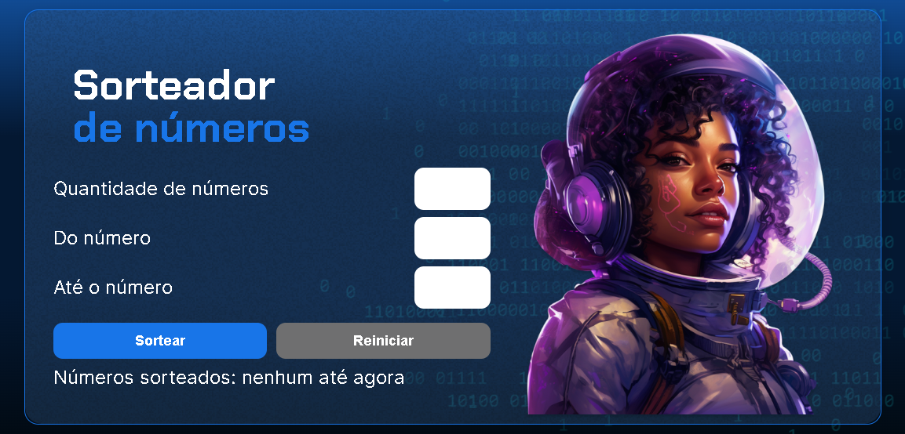

# Projeto sorteador de números



## Descrição do projeto
Projeto feito para reforçar os conhecimentos básicos de Javascript, onde o desafio era fazer com que criassemos um algorítimo que gerasse uma quantidade de números aleatórios com base em dados fornecidos pelo usuário, tais como:

- quantidade de números a serem sorteados;
- o número mínimo a ser sorteado;
- número máximo a ser sorteado.

Habilitar o botão de reiniciar e criar uma função para este botão que redefina todo o estado do sorteador ao inicial.

## Linguagens utilizadas no projeto
<div>
  
  
  
</div>

## Como Executar

Para executar este projeto localmente, siga os passos abaixo:

1. **Clone o repositório:**
    
    ```bash
    git clone https://github.com/LeozinGs/sorteador-numeros
    ```
    
2. **Navegue até o diretório do projeto.**
3. **Abra o arquivo `index.html` em seu navegador:**
    
    Basta dar um duplo clique no arquivo `index.html` ou abrir manualmente em seu navegador preferido.
